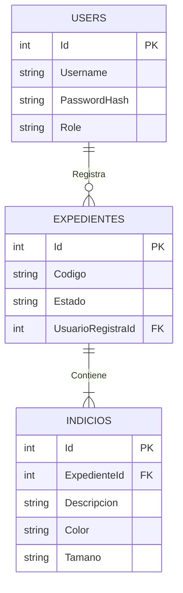

# Manual Técnico - Sistema de Gestión de Evidencias DICRI

## 1. Introducción
Este documento describe la arquitectura, diseño y componentes del sistema desarrollado para la DICRI.

## 2. Arquitectura del Sistema
El sistema utiliza una arquitectura de microservicios simplificada (monorepo) contenerizada.

### Diagrama de Arquitectura
```mermaid
graph TD
    Client[Cliente Web (ReactJS)] -->|REST API| API[Backend API (NodeJS)]
    API -->|SQL Protocol| DB[(SQL Server)]
    API -->|Docs| Swagger[Swagger UI]
```

## 3. Base de Datos
Se utiliza SQL Server 2022.

### Modelo Relacional (ER)


## 4. Backend (API)
Desarrollado en NodeJS con Express.
- **Autenticación**: JWT (JSON Web Tokens).
- **Base de Datos**: `mssql` driver con Stored Procedures.
- **Documentación**: Swagger en `/api-docs`.

### Endpoints Principales
- `POST /api/auth/login`: Iniciar sesión.
- `GET /api/expedientes`: Listar expedientes.
- `POST /api/expedientes`: Crear expediente.
- `POST /api/expedientes/indicio`: Agregar indicio.
- `PUT /api/expedientes/:id/status`: Aprobar/Rechazar.

## 5. Frontend
Desarrollado en ReactJS con Vite y TailwindCSS.
- **Estructura**:
    - `src/pages`: Vistas principales.
    - `src/components`: Componentes reutilizables.
    - `src/context`: Manejo de estado global (Auth).
    - `src/api`: Configuración de Axios.

## 6. Despliegue
El sistema se despliega utilizando Docker Compose.

```bash
docker-compose up --build
```

## 7. Decisiones Técnicas
- **Stored Procedures**: Se utilizaron para toda la lógica de base de datos para cumplir con los requisitos de seguridad y rendimiento.
- **TailwindCSS**: Para un desarrollo rápido y un diseño moderno y responsivo.
- **JWT**: Para una autenticación sin estado y segura.
